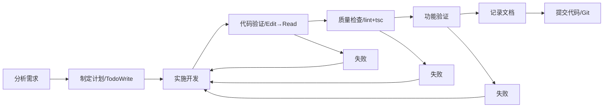

# Claude Code 项目指南

**文档版本**: 7.0
**创建日期**: 2025-01-11
**最后更新**: 2025-11-26 11:58
**更新者**: claude-sonnet-4-5 (claude-sonnet-4-5-20250929)
**适用范围**: uniform-fe (op-fe-66) 项目的所有 Claude AI 交互
**文档状态**: 生效中
**项目类型**: 企业级表单管理平台

---

## 关于本文档

本文档是 uniform-fe 项目的核心记忆文件，遵循 [Claude Code 官方指引](https://code.claude.com/docs/en/memory.md)。

**使用方式**:
- 自动加载：Claude Code 启动时自动发现并加载
- 快速编辑：使用 `/memory` 命令
- 文件导入：支持 `@path/to/file` 语法

**详细文档**:
- @README.md - 项目完整介绍
- @CLAUDES.md - 快速开发指南（短期记忆）
- @docs/01-指引/code-patterns.md - 代码模式和最佳实践
- @docs/01-指引/checklist.md - 完整检查清单
- @docs/99-知识/faq.md - 常见问题解答

---

## 项目铁律（10条必须遵守）

> 🚨 **重要**: 以下10条是项目的基本原则，**每次工作都必须遵守**。

### 铁律1：简体中文优先 🇨🇳
- ✅ 所有交流、文档、注释使用简体中文
- ✅ 技术术语可保留英文（React、TypeScript、Umi、Ant Design）
- ✅ 文件编辑时输出详细日志

### 铁律2：文档集中管理 📁
- ✅ 所有文档保存到 `docs/` 目录
- ✅ **必须包含**标准化的8个中文子目录：`01-指引/`, `02-需求/`, `03-架构/`, `04-设计/`, `05-实现/`, `06-测试/`, `07-交付/`, `99-知识/`
- ⚠️ **所有8个目录必须存在，不能缺失任何一个**

### 铁律3：文档元信息完整 📝
- ✅ 每个文档包含：文档编号、创建时间、最后修改、执行模型、文档状态
- ✅ **时间戳必须精确到分钟**（格式：`YYYY-MM-DD HH:mm`）
- ✅ 包含修改历史表
- ✅ AI模型使用完整标识（如 `claude-sonnet-4-5 (claude-sonnet-4-5-20250929)`）

### 铁律4：源码需求标注 🏷️
- ✅ 代码中标注需求编号（如有）
- ✅ 文件头部包含功能说明和相关文档引用

### 铁律5：验证优先原则 ✅
- ✅ **强制流程**: Edit → Read → 确认修改 → 功能验证
- ✅ 重要修改后运行代码质量检查
- ❌ 禁止没有 Read 就声称"已修复"
- ❌ 禁止假设修改会生效

**验证步骤**:
```
1. Edit 修改代码
2. Read 读取文件验证 ← 强制！
3. 确认修改在代码中
4. 运行 lint/tsc 检查（如适用）
5. 记录文档
```

### 铁律6：TypeScript 严格模式 📐
- ✅ 使用 `interface` 而非 `type`（除非需要联合类型或函数类型）
- ✅ 避免使用 `any`，使用 `unknown` 或具体类型替代
- ✅ 所有函数参数和返回值明确类型

### 铁律7：React 最佳实践 ⚛️
- ✅ 使用函数组件和 Hooks
- ✅ 组件文件遵循命名规范（见 @docs/01-指引/code-patterns.md）
- ✅ 自定义 Hook 以 `use` 开头
- ✅ 保持组件职责单一

### 铁律8：完整功能必须提交 Git 💾
- ✅ 每个完整功能立即提交
- ✅ 提交信息格式：
```bash
type(范围): 简短描述

详细说明：
- 变更内容
- 变更原因
- 影响范围

🤖 Generated with [Claude Code](https://claude.com/claude-code)
Co-Authored-By: Claude <noreply@anthropic.com>
```

### 铁律9：数据必须可追溯 📊
- ✅ 所有数字说明来源
- ✅ 所有结论说明依据
- ❌ 禁止未经验证的量化声明

### 铁律10：诚实透明优先 🔍
- ✅ 不确定时明确说明
- ✅ 错误时立即承认并纠正
- ✅ 推测时明确标注

---

## 项目概览

### 项目定位
uniform-fe (一体化表单管理平台) - 基于 React + Umi + Ant Design 的企业级表单管理平台，提供动态表单设计、版本控制、流程管理和权限控制等核心能力。

### 当前状态（2025-11-26）
- **技术栈**: TypeScript 4.9 + React 18.2 + Umi Max 4.1 + Ant Design 5.12
- **包管理器**: pnpm
- **开发端口**: 8000
- **主要分支**: master
- **项目代号**: op-fe-66
- **当前版本**: 6.0.51-beta.2

### 核心技术

| 技术 | 用途 |
|------|------|
| React 18.2 | 前端框架 |
| TypeScript 4.9 | 类型系统 |
| Umi Max 4.1 | 应用框架 |
| Ant Design 5.12 | UI组件库 |
| ProComponents 2.6 | 高级组件 |
| i18next | 国际化 |
| Quill 2.0.2 | 富文本编辑 |

### 目录结构
```
src/
├── common/           # 通用模块
│   ├── api/         # API 接口定义
│   ├── service/     # 业务服务层
│   ├── data_type/   # TypeScript 类型定义
│   └── code_list/   # 代码表/枚举
├── components/       # 公共组件
├── pages/            # 页面组件
│   ├── form/        # 表单管理
│   ├── template/    # 模板管理
│   ├── operation/   # 业务操作
│   └── system/      # 系统管理
├── lang/             # i18next 国际化
├── locales/          # Umi 国际化
├── app.tsx           # 运行时配置
└── access.ts         # 权限定义
```

### 路径别名
```typescript
@/*               → src/*
```

**注意**: 使用 `@/` 前缀进行绝对路径导入

---

## 常用命令

### 开发环境
```bash
pnpm dev              # 启动开发服务器（端口 8000）
pnpm start            # 同 pnpm dev
pnpm start:dev        # 开发环境（默认）
pnpm start:test       # 测试环境
pnpm start:no-mock    # 无 Mock 模式
```

### 代码质量
```bash
pnpm lint             # ESLint 检查
pnpm lint:fix         # 自动修复 ESLint 问题
pnpm tsc              # TypeScript 类型检查
pnpm prettier         # Prettier 格式化
```

### 构建和测试
```bash
pnpm build            # 生产构建
pnpm preview          # 预览生产构建
pnpm test             # 运行单元测试
pnpm test:coverage    # 测试覆盖率
```

### 快速验证
```bash
# 完整验证套件
pnpm tsc && pnpm lint && pnpm test && pnpm build
```

---

## 工作流程

### 标准流程（严格按顺序）



1. **分析需求** - 明确需求，询问不明确之处
2. **制定计划** - 使用 `TodoWrite` 工具创建任务清单
3. **实施开发** - 按计划逐步实现
4. **代码验证** - Edit → Read → 确认（强制）
5. **质量检查** - pnpm lint && pnpm tsc
6. **功能验证** - 开发环境测试（如适用）
7. **记录文档** - 创建或更新文档
8. **提交代码** - Git 提交（包含详细说明）

---

## 质量保证

### 三大核心原则

1. **诚实第一**: 宁可不完整，也要准确
2. **验证优先**: 每次 Edit 后必须 Read 验证
3. **逐项报告**: 用数字报告进度（X/Y）

### 金句提醒
> "没有 Read 验证的 Edit，就是薛定谔的修改"
> "报告进度用数字（X/Y），不用'全部'或'所有'"

---

## 快速参考

### 检查清单

**每次任务前**:
- [ ] 确认需求和验收标准
- [ ] 拉取最新代码
- [ ] 启动开发环境（如需要）

**每次任务中**:
- [ ] 遵循 TypeScript 和 React 规范
- [ ] 避免使用 `any` 类型
- [ ] 使用 `@/` 前缀导入
- [ ] 实时更新 todo 状态

**每次任务后**:
- [ ] **Edit → Read → 验证** ⚠️
- [ ] pnpm lint（代码规范）
- [ ] pnpm tsc（类型检查）
- [ ] 更新文档
- [ ] Git 提交（详细说明）

完整检查清单: @docs/01-指引/checklist.md

### 常用代码模式

详见: @docs/01-指引/code-patterns.md

**快速示例**:

```typescript
// API 调用三层架构
// 1. API 层
export const getDocumentList = (params: any) => {
  return request({ url: '/api/form/document/list', method: 'GET', params });
};

// 2. Service 层
export class DocumentService {
  static async fetchList(params: any) {
    const response = await getDocumentList(params);
    return response.data;
  }
}

// 3. 页面使用
const DocumentPage = () => {
  const [documents, setDocuments] = useState([]);
  useEffect(() => {
    const fetchData = async () => {
      const data = await DocumentService.fetchList({});
      setDocuments(data.list);
    };
    fetchData();
  }, []);
};

// ProTable 使用
<ProTable
  columns={columns}
  request={async (params) => {
    const { list, total } = await DocumentService.fetchList(params);
    return { data: list, total, success: true };
  }}
/>

// 国际化
const { t } = useTranslation();
const title = t('document.templateName');
```

### 常见问题

详见: @docs/99-知识/faq.md

**快速解决**:
- 导入路径失败 → 使用 `@/` 前缀
- 类型错误 → `pnpm tsc`
- 代码规范 → `pnpm lint:fix`
- API 调用失败 → 检查代理配置和后端服务
- 构建失败 → 清理缓存重新安装依赖

---

## 文档管理

### 标准目录结构

> ⚠️ **重要**: 以下8个目录必须全部存在，不能缺失任何一个！

```
docs/
├── 01-指引/       # 项目指引、规范、检查清单
├── 02-需求/       # 需求文档
├── 03-架构/       # 系统架构设计
├── 04-设计/       # 详细设计文档
├── 05-实现/       # 实现文档、变更日志
├── 06-测试/       # 测试文档、验证报告
├── 07-交付/       # 交付文档、发布说明
└── 99-知识/       # 知识库、FAQ、故障排查
```

### 文档元信息模板

> ⚠️ **重要**: 时间戳必须精确到分钟（格式：YYYY-MM-DD HH:mm）

```markdown
# 文档标题

**文档编号**: REQ-001-001
**创建时间**: YYYY-MM-DD HH:mm
**最后修改**: YYYY-MM-DD HH:mm
**执行模型**: claude-sonnet-4-5 (claude-sonnet-4-5-20250929)
**文档状态**: 草稿 / 评审中 / 已确认

---

## 修改历史

| 日期 | 修改人/模型 | 修改概要 |
|------|------------|---------|
| YYYY-MM-DD HH:mm | claude-sonnet-4-5 | 创建文档 |

---

[文档正文]
```

---

## 核心业务知识

### 1. 数据模型层次

```
DocumentTemplate (文档模板)
    ↓ 1:N
DocumentTemplateVersion (文档模板版本)
    ↓ 1:N
Document (文档实例)
    ↓ 1:N
FormTemplateVersion (表单模板版本)
    ↓ 1:1
Form (表单实例)
    ↓ 1:N
FormSection (表单区块)
    ↓ 1:N
FormQuestion (表单问题)
```

### 2. 核心功能模块

**表单管理**:
- 动态表单引擎 - 支持变量化表单设计
- 表单实例管理 - 创建、编辑、查看、提交
- 数据填写和审核

**模板管理**:
- 文档模板设计 - 可视化模板编辑
- 表单模板配置 - 字段、验证规则、联动
- 版本控制 - 版本发布、回滚

**权限控制**:
- 菜单级权限 - 基于 menuCode
- 页面级权限 - access 对象
- 数据级权限 - viewerList / editorList

**通知系统**:
- 通知配置 - 触发条件、通知方式
- 通知历史 - 发送记录、回执

### 3. 通用化改造

项目正在从**港口航运专用系统**向**跨行业通用平台**演进。

**核心文档**:
- @docs/02-需求/PRODUCT_TRANSFORMATION_PLAN.md - 产品化改造方案
- @docs/05-实现/KICKOFF_TASKS.md - 实施任务清单

**改造要点**:
1. 字段动态化 - 将行业特定字段改为可配置
2. 场景配置系统 - 支持多行业场景
3. Connector 架构 - 支持外部系统集成

---

## 版本历史

| 版本 | 日期 | 变更说明 | 修订人 |
|------|------|---------|--------|
| 1.0 | 2025-01-11 | 初始版本 | Claude AI |
| 2.0 | 2025-01-13 | 添加详细架构和业务知识 | Claude AI |
| 7.0 | 2025-11-26 | 参考官方指南重构，精简主文档，拆分详细内容 | claude-sonnet-4-5 |

### 版本7.0主要变更

**文档体系重构**:
- ✅ 按照 Claude Code 官方指南重构文档结构
- ✅ 精简 CLAUDE.md 主文档（从 917 行精简到约 450 行）
- ✅ 创建标准8个中文子目录（01-指引/ 到 99-知识/）
- ✅ 拆分详细内容到专门文档：
  - `docs/01-指引/code-patterns.md` - 代码模式和最佳实践
  - `docs/01-指引/checklist.md` - 完整检查清单
  - `docs/99-知识/faq.md` - 常见问题解答
- ✅ 使用 @ 语法引用详细文档
- ✅ 添加文档元信息规范（时间戳精确到分钟）
- ✅ 添加项目铁律（10条必须遵守）
- ✅ 强化验证优先原则和质量保证

**文档使用**:
- 主文件作为快速参考和导航索引
- 详细内容按主题组织到专门文档
- 通过 `@path/to/file` 引用详细文档

---

## 核心提醒

**项目铁律** (务必遵守):
1. 🇨🇳 简体中文优先
2. 📁 文档集中管理（docs/ 8个子目录）
3. 📝 元信息完整（时间戳精确到分钟）
4. 🏷️ 源码功能标注
5. ✅ 验证优先（Edit → Read → 确认）
6. 📐 TypeScript 严格模式（避免 any）
7. ⚛️ React 最佳实践（函数组件 + Hooks）
8. 💾 完整功能立即提交 Git
9. 📊 数据可追溯
10. 🔍 诚实透明

**快速访问**:
- 代码模式: @docs/01-指引/code-patterns.md
- 检查清单: @docs/01-指引/checklist.md
- 常见问题: @docs/99-知识/faq.md
- 快速指南: @CLAUDES.md
- 项目介绍: @README.md

---

**本文档遵循自身定义的所有规范，可作为规范执行的参考示例。**

**版本**: 7.0（2025-11-26 11:58）- 参考官方指南重构，精简主文档，拆分详细内容
